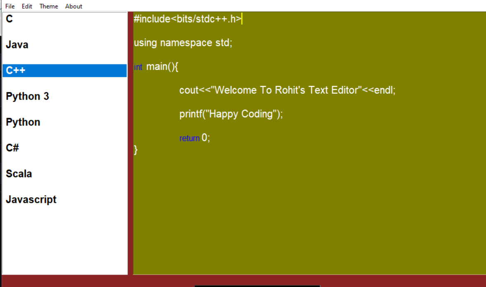

# Coding Text Editor Using Python Tkinter GUI 

This is Text Editor where you can write code in any language, following features added in Editor
- Theme Changing -> You can change Text color and Editor color.
- Keyword Highlighting-> Keyword highlighting for C programming has been implemented. Later on add for other Language also.
- Input and Output Box.
- File Menu -> New, Open , Save, Save as,Close added
- Edit Menu -> Cut, Copy, Paste option added.

## Libraries Used
TKinter

## Language
Python

## UI
- Main Screen
  

  

- Theme Menu

- File Menu
  

- ColorBox for Choosing Theme Color
  

- New Theme 
  

## Future Scope
1. Most Difficult part is to add compiler and interpreter to text editor but this can be done for providing running code facility to programmer.
2. Currently Identifier highlighting is done only for C language , this can be done for other language too.
3. Adding other editor feature like font size, Tab size, intellisense.